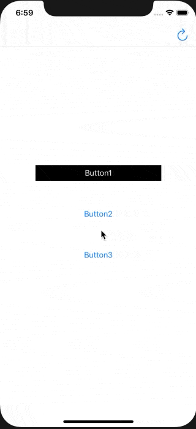

# LoaidngButton



# Usage
```
let button = LoadingButton()
// toggle isLoading
button.isLoading = true
// loading style
button.indicatorView.style = .gray
button.indicatorView.color = .systemBlue

```